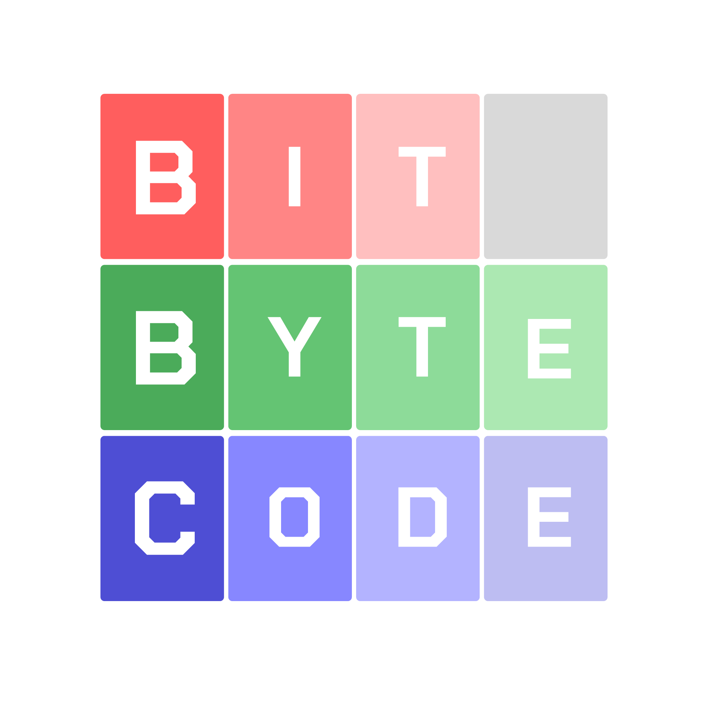
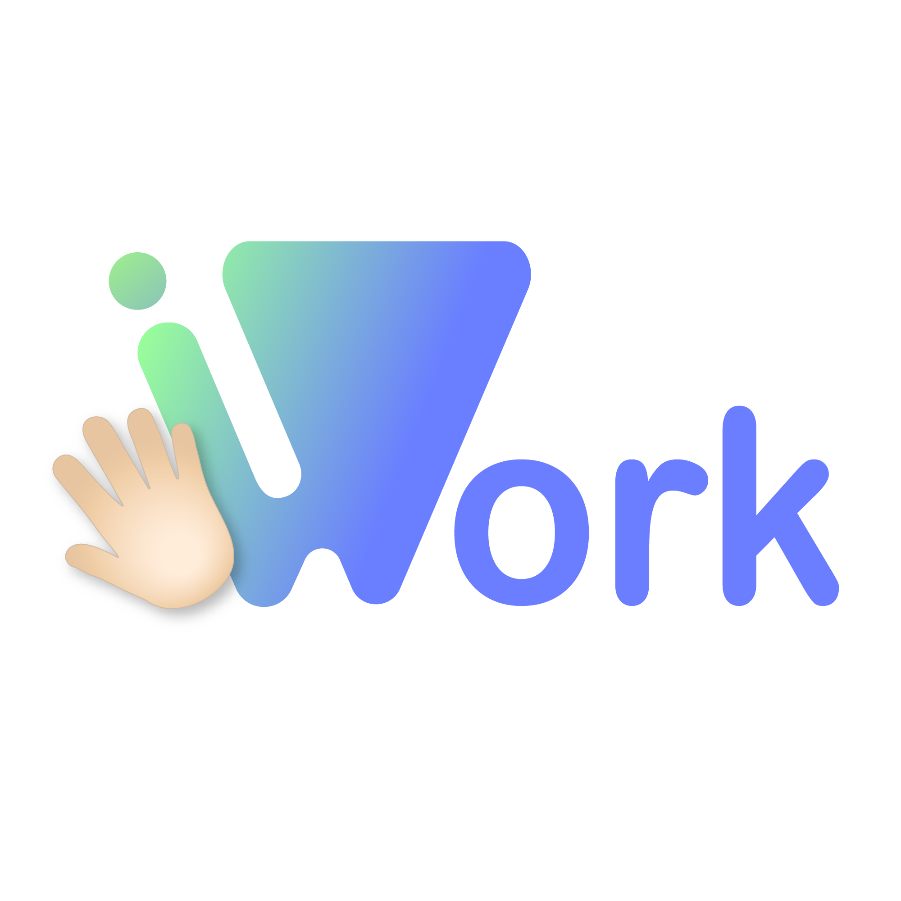

# Команда BitByteCode ([bitbytecode.ru](https://bitbytecode.ru))

Это команда разработчиков, объединённых с целью создания современных и удобных приложений.
Наше название отзывает к исторической последовательности пути, который привёл нас к сегодняшним возможностям:
- Всё началось с появления цифровой логики, минимальной единицей которого является **bit** (binary digit) - цифра с одним из двух возможных логических состояний: 0 или 1.
- С помощью цифр можно составить число. Так же и с **byte** - состоит из 8 разрядов bit. Почему же 8? - именно столько бит было достаточно на заре развития информационных технологий для обозначения одного текстового символа!
- Как вам известно - программный **код** пишется на языках программирования, которые описывают соглашение о том, какая последовательность символов вызывает соответствующие команды. И каждый символ - это байт.

# Востребованный стек программирования
Команда изучает и применяет современные технологии в области разработки программных решений.

### Программирование
- Java
- Spring boot / web / jpa / jdbc
- Android studio
- JavaScript

### Базы данных
- PostgreSQL
- MS SQL
- SQLite
- MongoDB
- Redis

### Брокеры сообщений
- RabbitMQ
- Kafka

### Сетевые технологии
- WebAPI
- Server-Send Events (SSE)
- Web Sockets
- OAuth / JWT

### Развёртывание
- Docker
- Docker Compose
- Git
- GitHub CI/CD
- GitHub Container Registry (GHCR)
- Виртуализация

### Графика и дизайн
- Figma
- HTML / CSS / JS
- Adobe Illustrator
- Adobe After Effects
- Adobe Photoshop
- и т.п.

### Прикладные технологии
- Внедрение ИИ
- Анализ больших данных
- Методология AGILE / SCRUM
- Использование Kanban

# Наши партнёры
Мы получили задание на разработку программного решения в сфере  HR-менеджмента от крупного многопрофильного холдинга **Т1-Холдинг**. В рамках конкурсной программы начат проект программного решения **"Hi.Work!"**, которое призвано упростить, автоматизировать и оптимизировать деятельность HR-отдела во взаимодействии с сотрудниками.

# Наше обучение
Каждый из нас заинтересован в повышении своей квалификации и приобретении новых навыков. Мы проходим обучение как самостоятельно, так и в рамках IT-Cube.Рязань, которая сотрудничает со множеством других образовательных организаций: как бюджетных, так и коммерческих. Мы активно участвуем в различных конкурсных движениях, хакатонах различной направленности, а так же конференциях, чтобы всегда быть в курсе актуальных событий.

# Об участниках
Наши участники - как ученики, так и практикующие специалисты.

### Руководитель команды - Васильева Анна Сергеевна
Опытный специалист в области разработки программных решений для бизнеса. Имеет общий стаж профессиональной деятельности более 10 лет как в коммерческих, так и в бюджетных организациях.
Особый интерес - Backend разработка распределённых приложений на основе микросервисной архитектуры.
Образование:
- РГТК (СПО, 4 года) - 09.02.07 - Информационные системы
- РГРТУ (Бакалавриат, 5 лет) - 09.03.02 - Информационные системы и технологии
- РГРТУ (Магистратура, 2 года) - 09.04.02 - Информационные системы и технологии

На регулярной основе участвует в выступлениях на конференциях, проходит обучение для повышения квалификации.
Основной проект: глобальная образовательная среда для различных образовательных организаций: account.vsa5edu.ru
Связь и сотрудничество: vsa5edu@gmail.com

### Разработчик (Android, AI и т.п.) - Плетнёв Сергей

### Разработчик (Backend, WebAPI и т.п.) - Махмудов Александр

### Разработчик (Web, Android и т.п.) - Новиков Милен

### Разработчик (Backend, Базы данных и т.п.) - Стец Алексей

### UI/UX - Золотова Софья

# О проекте Hi.Work ([сайт](https://bitbytecode.ru/#hiwork-project))

Программное решение Hi.Work представляет из себя комплекс программ для повышения вовлеченности сотрудников крупных организаций в карьерном росте! Мы проанализировали множество статей и источников касательно геймификации и разработали собственную модель, которая сволит к минимуму проблемы существующих:
- раздражение сотрудников, которое возникает при повышении требований от менеджмента: вечные уведомления, горящие спринты и обязанность проходить задания, которые зачастую не связаны напрямую с трудовым договором;
- сложные дешборды с бесполезными и необъективными показателями продуктивности
- всеобъемлющая вовлечённость сотрудника в корпоативную жизнь: конкурсы, тренинги и мероприятия - если их становится много, то начинает страдать целевая деятельность компании

### Внедрение искусственного интеллекта
Ещё одной проблемой стала популяризация ИИ (искусственного интеллекта), который рекламируют как средство решения всех проблем. Мы постарались аккуратно внедрить его в наше приложение как инструмент автоматизации, а не принятия решений.
В обычной жизни до сих пор не обойтись без участия человека, особенно когда дело касается HR-менеджмента, деятельность которого напрямую направлена на взаимодействие с сотрудниками (всё ещё людьми).
Поэтому подтверждение действий сотрудников (например, получение нового навыка или прохождение собеседования) так же можно производить вручную - приложение позвояет подключать для этого различные сторонние сервисы (сервисы тестирования, запуска определённого скрипта, запросов к внешним API).

### Подходы
Мы постарались над проработкой концепций, графического дизайна и эргономики. Мы отказались от внедрения маскота как персонажа геймификации, чтобы не повышать уровень тревоги и не ассоциировать возможные возникающие проблемы с ним (наверняка вы знаете про зелёную сову). Так же, в концепте приложения намеренно избегаются резкие цвета, а так же фразы, способные отбить желание сотрудника в повышении своей квалификации (например, вместо "навык не подтверждён" (будто он обязан быть таковым) отображается кнопка "запросить получение навыка" и т.п.).
По части UI/UX мы стараемя внедрять интуитивно понятные изображения и контроллеры для уменьшения количество поясняющего текста, который может "замусорить" интерфейс.

### Геймификация
Наш подход к геймификации состоит в механике получении баллов - внутриигровая валюта, которую можно обменять на различные вознаграждения: подарки, сертификаты, подписки и т.п.
Баллы можно получить за получение нового навыка, а так же заданий в приложении.
Так же существует система ачивок, аналогично ачивкам в играх - это отметка, которую можно получить при исполнении различных действий как в приложении, так и в жизни (при подтверждении куратором).

### Дополнительные возможности
Для повышения уровня вовлечённости, в приложении так же внедрён TODO-лист сотрудника на сегодня. Это простое приложение, которое направленно на структурирование своего времени в рамках рабочего дня. При использовании этого функционала, сотрудники косвенно могут ознакомиться с новостями и уведомлениями, которые могут его заинтересовать. Так же, информация из TODO-листа может помочь в анализе деятельности и формированию пользовательского профиля, на основе которого можно подобрать наиболее релевантный карьерный путь в организации.

### Профиль пользователя
Профиль пользователя - это его некий информационный отпечаток. В нём он может заполнить необходимую информацию о себе: "Обо мне", "Личные навыки" (те, что отсутствуют в системе для подтверждения), "Резюме", "Портфолио" (список работ различных направлений), "Личный план развития" (pipeline). Эта информация поможет подобрать реально подходящий карьерный путь!

### Карьерный путь
В крупных организациях существует огромный выбор карьерных возможностей. Мы структурировали это следующим образом.
В приложении хранится список карьерных путей. Каждый из них - это цепочка, которая описывает последовательность должностей по возрастанию (линейный граф грейдов).
Для каждой должности описывается список необходимых навыков.
В свою очередь, навык - это некоторое профессиональное умение, которое необходимо подтвердить. У навыков так же может быть свой грейд - уровень освоения. Однако в отличие от должностей карьерного пути, сотрудник может сразу выбрать уровень для подтверждения. При совпадении текущих навыков сотрудника с некоторой должностью - он может на неё претендовать, если в организации есть соответствующая открытая вакансия.
Навыки могут быть как перманентными, так и действовать в течение некоторого периода, после которого его необходимо подтверждать повторно.
Подтверждение навыка выполняется ответственным за это лицом, который сам определяет порядок этого процесса: автоматически, с помощью ИИ или самостоятельно.

### Аналитика и отчётность
На основе данных сотрудника, которые находятся в базе, внедрённый искуственный интеллект может отвечать на вопросы сотрудника, выдвигать предложения, а так же давать отчёты по различным критериям в удобном человекоподобном текстовом интерфейсе. Некоторые формы отчёта могут подготовить HR-менеджеры самостоятельно: скрипт или ИИ-промт, который описывает необходимые аспекты.
В качестве примеров запросов можно привести следующие:
- какие навыки мне стоит изучить для должности?
- как ты оцениваешь моё текущее карьерное состояние?
- как подготовиться к подтверждению навыка?
- как грамотно оформить TODO-лист?
- что скажешь про мою деятельность за текущий месяц?
- какие есть выгодные предложения по обмену баллов?

и т.п.

### Ожидания после внедрения
Ожидаетя, что данное программное решение станет полезным дополнением, которое уменьшит объём рутинной деятельности и направит ценное рабочее время сотрудников на решение действительно важных и целевых задач компаний.
