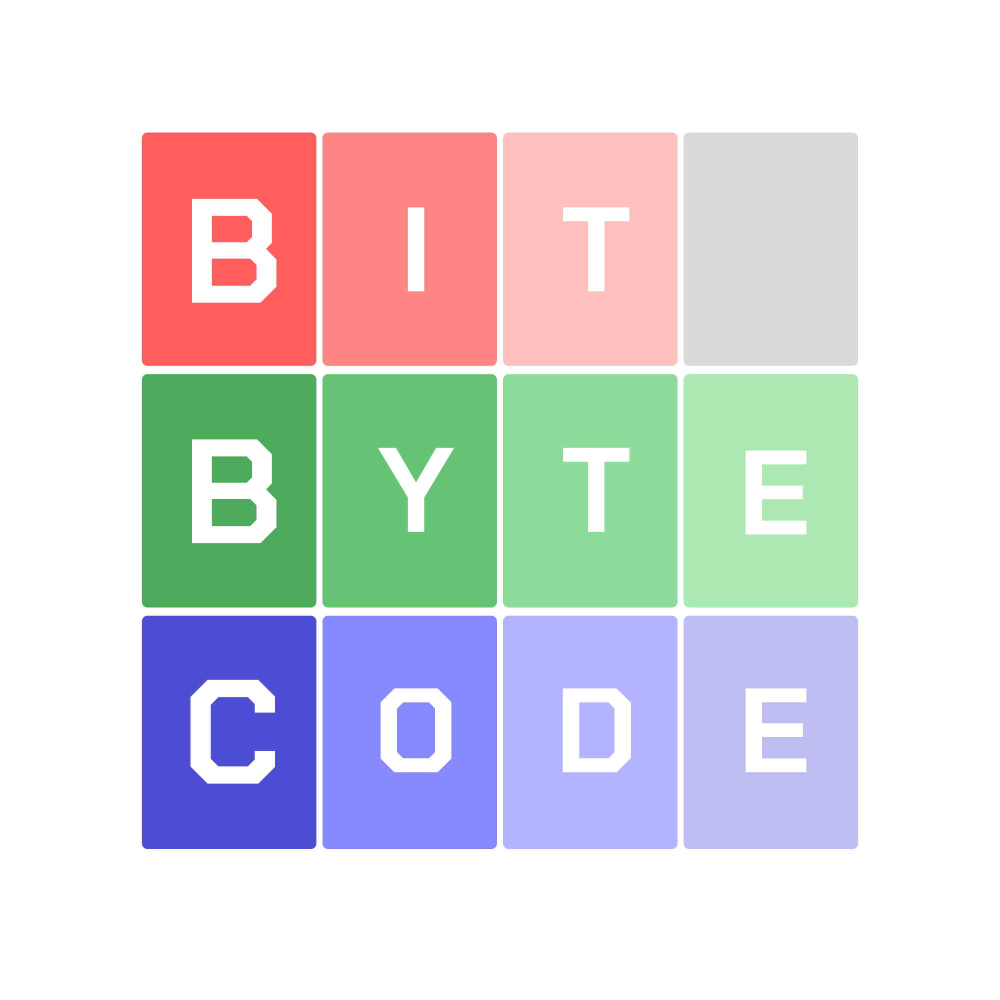

# Команда BitByteCode ([bitbytecode.ru](https://bitbytecode.ru))

Это команда учеников, объединённых целью создания современных и удобных приложений.
Наше название отзывает к исторической последовательности пути, который привёл нас к сегодняшним возможностям:
- Всё началось с появления цифровой логики, минимальной единицей которого является **bit** (binary digit) - цифра с одним из двух возможных логических состояний: 0 или 1.
- С помощью цифр можно составить число. Так же и с **byte** - состоит из 8 разрядов bit. Почему же 8? - именно столько бит было достаточно на заре развития информационных технологий для обозначения одного текстового символа!
- Как вам известно - программный **code** пишется на языках программирования, которые описывают соглашение о том, какая последовательность символов вызывает соответствующие команды. И каждый символ - это байт.

# Наше обучение
На базе IT-Cube в г. Рязань, в рамках направления программирования на Java изучаются наиболее актуальные технологии и подходы в разработке современных приложений.
Каждый из нас заинтересован в повышении своей квалификации и приобретении новых навыков. Мы проходим обучение как самостоятельно, так и в рамках IT-Cube.Рязань, которая сотрудничает со множеством других образовательных организаций: как бюджетных, так и коммерческих. Мы активно участвуем в различных конкурсных движениях, хакатонах различной направленности, а так же конференциях, чтобы всегда быть в курсе актуальных событий.

# Востребованный стек программирования
Команда изучает и применяет современные технологии в области разработки программных решений, с которым вы можете ознакомиться на bitbytecode.ru

# Наши партнёры
В рамках IT-Cube в г. Рязань мы сотрудничаем с различными организациями, как малыми так и крупными. Всё для того, чтобы ученики с самого начала пути видели реальную кухню разработки, а так же получили возможности настоящего сотрудничества.
Многие ученики направления программирования Java успешно поступают в ведущие технические ВУЗы, а так же получают предложения по работе.
Обучение по направлению Java - это отличная возможность начать свою карьеру!

# ИТ школа Самсунг
В рамках обучения по направлению Java реализуется программа ИТ школы Самсунг по направлению мобильной разработки.
Обучение в данной школе - это возможность получить легитимное образование, которое котируется во всём мире! При успешном окончании курса, обучающиеся получают сертификат международного образца. Многие ведущие технические вузы дают приоритет в виде баллов ЕГЭ (от 3 и выше, в зависимости от вуза).
Лучший проект курса имеет возможность участия во всероссийском конкурсе "ИТ школа выбирает сильнейших"!

### Педагог - Васильева Анна Сергеевна
Опытный специалист в области разработки программных решений для бизнеса. Имеет общий стаж профессиональной деятельности более 10 лет как в коммерческих, так и в бюджетных организациях.
Особый интерес - Backend разработка распределённых приложений на основе микросервисной архитектуры.
Образование:
- РГТК (СПО, 4 года) - 09.02.07 - Информационные системы
- РГРТУ (Бакалавриат, 5 лет) - 09.03.02 - Информационные системы и технологии
- РГРТУ (Магистратура, 2 года) - 09.04.02 - Информационные системы и технологии

Имеет квалификацию ИТ школы самсунга по направлению мобильной разработки.

На регулярной основе участвует в выступлениях на конференциях, проходит обучение для повышения квалификации.
Основной проект: глобальная образовательная среда для различных образовательных организаций.
Связь и сотрудничество: vsa5edu@gmail.com
